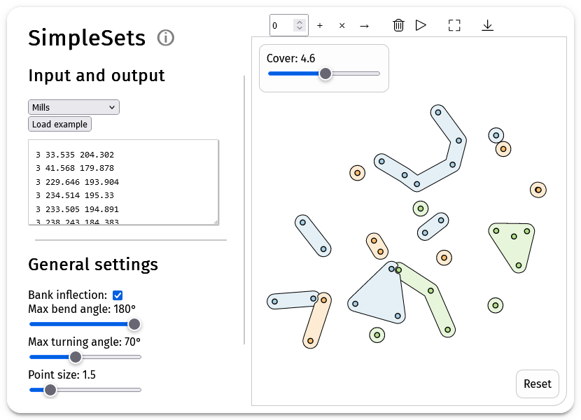

# SimpleSets: Capturing Categorical Point Patterns with Simple Shapes
 

This repository contains a prototype implementation of SimpleSets.
Given a set of points in the plane that each belong to one category, SimpleSets creates simple shapes that enclose patterns in the data.
The visualization is described in more detail in the corresponding paper:
> Steven van den Broek, Wouter Meulemans, Bettina Speckmann. _SimpleSets: Capturing Categorical Point Patterns with Simple Shapes_. Accepted as a full paper to IEEE VIS 2024.

The implementation is written in the Kotlin programming language.
The computational part of the code is multiplatform.
Two UIs are available: a web UI and a JVM UI.
The web UI is more accessible and easier to use, but the JVM UI performs the computations faster.

## Setting up the project locally
The easiest way to use the implementation is to use [the web UI](https://tue-alga.github.io/SimpleSets/).
If you want to use the JVM-based implementation or modify the code, you need to set up the project locally.
One way to do this is as follows.
This projected has been tested with [OpenJDK](https://openjdk.org/) versions 20 and 21.
1. [Download IntelliJ IDEA](https://www.jetbrains.com/idea/download/)
2. Download the SimpleSets repository and open it as a project in IntelliJ IDEA (this may take a while to load).
3. In the IDE move to `src/jvmMain/Main.kt` and run this file by clicking on the green arrow next to the main function. 
This should cause a window to appear. If there is a NoClassDefFoundError about `mu/KotlinLogging` then do the following.
At the top of the screen next to the screen arrow click on the three dots and 'Edit (configuration)'.
In the screen that opens click the plus sign at the top left and select 'Gradle'. Under Run fill in
"jvmRun -DmainClass=MainKt --quiet", and leave the rest as the default. Click save and run this configuration. 

The left blue part of the screen is the settings window.
Pressing F11 toggles the visibility of the settings window. 
Load (example) input from via this window.
Press the spacebar to run the algorithm; make sure no field or button in the UI is active before clicking spacebar by clicking somewhere on the screen first.
Non-example inputs have to be loaded from a file in the `input-output` directory at the root of the repository; you might need to create the directory.
Use a .txt file that contains a point on each line in the format
`c x y` where `c` is a non-negative integer representing the category of the point, and `x` and `y` are the coordinates of the point.

As a starting point, also have a look at [GenerateExample.kt](src/jvmMain/kotlin/GenerateExample.kt), a simple entry point that generates an SVG file from an example input, and [grsi-run.sh](grsi-run.sh), a simple script for Linux that installs an appropriate JDK and runs [GenerateExample.kt](src/jvmMain/kotlin/GenerateExample.kt).

## Remarks
This implementation does not deal with the case where a stacking preference cannot be satisfied. 
However, this does not occur in any dataset we have encountered.
The implementation is not fully robust.
As a result, it can crash on certain input; especially areas that are very dense (either by using a large point size or having close point positions) are difficult to handle.
If in the web page the loading bar of Computing... is stuck at the end for a long time, then the implementation has crashed behind the scenes (you can check the console to know for certain).
In such a case, please reload the web page and try again with a smaller point size setting.

## Used software libraries
The implementation uses the [OPENRNDR](https://openrndr.org/) Kotlin library for most basic geometric, math, and color operations and for creating the JVM UI.
The JS UI is made using [Kotlin wrappers](https://github.com/JetBrains/kotlin-wrappers/tree/master/kotlin-react) for [React](https://react.dev/).
We use the offsetting operators of [JTS](https://github.com/locationtech/jts) in JVM and a [Kotlin port of Clipper](https://github.com/Monkey-Maestro/clipper-kotlin-multiplatform/tree/master) in JS to smooth the circular cutouts.
